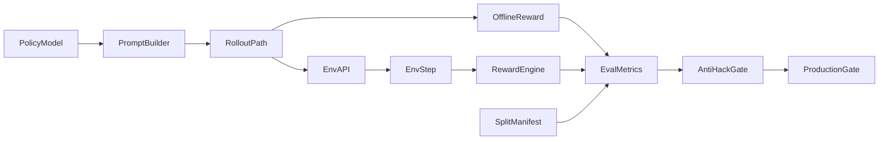

# RL Production Readiness Audit Plan

## Verdict
- Current status is **No-Go for real-time production**.
- The reward system still allows a **medium-score equilibrium** (safe generic outputs that avoid strong penalties), so reward increase alone cannot be treated as proof of policy learning.
- The codebase has strong scaffolding, but reward anti-gaming, train/serve parity, and evaluation rigor must be fixed first.
- With a **20-hour Kaggle budget**, the target should be **production-ready foundation** (robust anti-hack + validated learning), not full enterprise qualification.

## 20-Hour Kaggle Strategy (Recommended)
- Objective: achieve a **deployable v1 candidate** with anti-reward-hack controls, reliable evaluation, and stable policy gains.
- Compute policy: use **offline reward path for training**, then run **short online parity checks**.
- Budget policy: do **multiple gated runs** instead of one long run.

### Time Budget (Hard Cap: 20h)
- **Block A (2h):** Baseline + smoke + anti-hack probes before any tuning.
- **Block B (5h):** Main Run #1 (300-450 steps total) + checkpoint eval.
- **Block C (5h):** Main Run #2 (additional 300-450 steps) only if gates pass.
- **Block D (4h):** Targeted hard/robustness continuation (200-350 steps effective).
- **Block E (2h):** Final evaluation suite + report + model packaging.
- **Buffer (2h):** restarts, OOM mitigation, notebook/session interruptions.

### Step Budget Under 20h
- **Minimum viable target:** 350-500 steps total.
- **Strong target:** 700-1000 steps total.
- **Stretch target (if fast run speed):** 1100-1400 steps total.
- Do not attempt 2000+ within Kaggle unless you confirm unusually low step time.

### Training Profile For 20h
- Keep T4-safe defaults: `num_generations=4`, `batch_size=1`, `grad_accum=8`.
- Use `max_completion_length=640` to reduce truncation risk.
- Preferred schedule:
- Segment 1: 200-300 steps, `lr=2e-5`, `beta=0.03`.
- Segment 2: 200-300 steps, `lr=1.5e-5`, `beta=0.02`.
- Segment 3: 150-300 steps, `lr=1e-5`, `beta=0.01-0.015`.
- Evaluate after every segment and continue only if gates pass.

### Go/No-Go Gates Per Segment
- **Gate 1 (anti-hack):** template-style outputs must not score competitively.
- **Gate 2 (learning):** held-out outcome/statutory metrics must improve, not only composite reward.
- **Gate 3 (stability):** reward variance should not collapse; outputs should not become repetitive boilerplate.
- **Gate 4 (robustness):** no regression on perturbation/stress subset.
- If any gate fails, stop scaling steps and fix reward/eval design first.

## Re-Audit Highlights (Including Your Reward-Hack Concern)
- **Confirmed medium-score hack path:** several reward heads still give neutral/partial credit to generic outputs, enabling stable plateau behavior ([server/reward.py](D:/UnderTrial/Undertrial/server/reward.py)).
- **Train/serve mismatch remains a core risk:** trainer and env path do not always optimize identical objective surfaces ([training/train_grpo.py](D:/UnderTrial/Undertrial/training/train_grpo.py), [server/undertrial_environment.py](D:/UnderTrial/Undertrial/server/undertrial_environment.py)).
- **Data/eval protocol is not yet production-grade:** difficulty curriculum and evaluation slices are still too weak for strong generalization claims ([training/train_grpo.py](D:/UnderTrial/Undertrial/training/train_grpo.py)).
- **Hyperparameter budget is currently underpowered for medium/hard confidence:** 340-step curriculum is useful for experimentation, not final policy validation.

## Critical Blockers (Must Be Cleared In Order)
- **P0: Reward anti-gaming gaps:** length/format/keyword and partial-credit surfaces still permit safe generic strategies.
- **P0: Reward contract drift:** trainer extras and env scoring differences can reward different behavior for the same completion.
- **P0: Statutory inconsistency:** threshold logic and process proxies are not consistently tied to legal computation.
- **P1: Evaluation leakage/weakness:** small/unstable slices and fallback behaviors cannot establish robust learning.
- **P1: Serving hardening gap:** in-memory sessions, security posture, and observability are not ready for production guarantees.

## Anti-Reward-Hack Design Requirements (Non-Negotiable)
- Any reward component that can be solved by boilerplate text alone must be capped or gated.
- Missing labels must not silently produce neutral credit unless weight is renormalized.
- Outcome/statutory/fairness heads must be robustly separable in metrics and monitored independently.
- Train and serve must use one canonical scoring path with a versioned contract and parity tests.
- Reward gains are invalid unless matched by held-out outcome accuracy, adversarial robustness, and fairness slice stability.

## Updated Remediation Roadmap (Implementation-Safe, Weak-Model Friendly)

### Phase 0: Freeze and Baseline (No Behavior Change)
- Create a locked baseline report from current run: reward component distributions, outcome accuracy proxy, bias/NDPS slices, and representative failure cases.
- Save run manifest with git SHA, dataset fingerprint, reward version, and trainer config snapshot.
- **Gate:** baseline package reproducible by rerun on same seed/config.

### Phase 1: Anti-Reward-Hack Hardening (Do First)
- Remove/limit medium-safe partial credits that do not require substantive correctness.
- Replace weak proxies with consistency checks across fields (outcome, statutory computation, risk reasoning, conditions).
- Eliminate reward terms that depend on prompt-visible copying behavior.
- Add explicit anti-template penalty signal (or anti-boilerplate discriminator) with small bounded weight.
- **Gate:** adversarial template policy scores below honest structured policy on fixed probes.

### Phase 2: Reward Contract Parity Lock
- Define one canonical reward API and consume it identically from training and env execution.
- Add component-level parity tests for offline and API paths on golden fixtures.
- Add explicit termination reason semantics (`success`, `blocked_submit`, `truncated`) and score accounting.
- **Gate:** bitwise or epsilon-level parity on reward components across all execution paths.

### Phase 3: Evaluation Protocol Hardening
- Enforce immutable train/val/test splits by case ID; no fallback to train-like evaluation for reporting.
- Add deterministic eval mode and confidence intervals across 3+ seeds.
- Build adversarial suites: template attacks, numeric perturbations, schema drift, parity edge cases, NDPS edges.
- **Gate:** primary KPIs improve with confidence bounds; anti-hack suite does not regress.

### Phase 4: Training Budget and Hyperparameter Refit
- Replace one-size-fits-all schedule with 3 explicit profiles:
- **Smoke profile:** 8-15 steps, fast sanity and anti-regression.
- **Dev profile:** ~720-1400 total curriculum steps with medium-focused budget increase.
- **Production-candidate profile:** ~2000-6000+ steps with stricter eval cadence and checkpoint selection.
- Add warmup + LR schedule + KL schedule; standardize `max_completion_length` to avoid truncation artifacts.
- **Gate:** learning curves show non-trivial gains on held-out task metrics, not only composite reward.

### Phase 5: Serving, Security, and Ops Hardening
- Harden session management and concurrency model; document single-worker constraints or externalize state.
- Add API auth/rate-limit/CORS restrictions for non-local use.
- Add observability: reward-source parity flags, latency/error SLOs, blocked-submit and repeat-tool rates.
- **Gate:** load test and reliability SLOs pass with no critical security gaps.

### Phase 6: Production Qualification
- Run a final certification bundle: reward anti-hack tests, parity tests, fairness slices, legal-risk checks, rollback drill.
- Define staged rollout policy (shadow, limited exposure, monitored expansion).
- **Gate:** no P0/P1 issues open and all certification gates pass.

## Recommended Training Profiles (Explicit Defaults)
- **Smoke:** `steps=8-15`, `num_generations=4`, `lr=5e-6`, `beta=0.02`, `max_completion_length=640`.
- **Dev:** `easy=120-200`, `medium=400-800`, `hard=200-400`, `num_generations=4-6`, `lr=1e-5..3e-5`, warmup 3-5%, beta schedule `0.02-0.03 -> 0.01`.
- **Production-candidate:** `total_steps=2000-6000+`, `num_generations=6-8`, `lr=5e-6..1.5e-5`, strict eval/anti-hack gates every checkpoint window.
- **Episode coverage rule:** target multi-pass exposure on medium/hard strata; current 340-step run is exploratory, not sign-off quality.

## Acceptance Criteria (Project-Wide)
- Reward hacking probes cannot achieve competitive scores via generic templates.
- Held-out outcome/statutory/fairness KPIs improve with confidence bounds across seeds.
- Train/serve reward parity is verified by automated contract tests.
- Stage-4/schema-drift and adversarial suites show non-regression.
- Real-time serving SLOs and safety controls pass before exposure.

## Implementation Blueprint For Any Model (Strict Sequence)
- Step 1: add tests first (anti-hack + parity) without changing behavior.
- Step 2: patch reward components behind flags and verify tests.
- Step 3: remove flags after parity + anti-hack pass.
- Step 4: harden data splits/eval scripts and freeze benchmark manifests.
- Step 5: tune training profiles incrementally (smoke -> dev -> production-candidate).
- Step 6: productionize serving and rollout only after gates are green.

## System View


## Priority Order For Execution
- Anti-reward-hack controls first.
- Reward parity second.
- Evaluation hardening third.
- Hyperparameter and budget tuning fourth.
- Serving and production rollout last.

## Scope Reality Check
- This is **not too much** if done in strict phases; it is too much only if attempted as one large refactor.
- Treat it as 6-8 small PRs over 1-2 weeks, each with one acceptance gate.
- Do not start hyperparameter scaling until anti-hack and parity tests are green.

## Observed Run Failures (From Your Latest Logs)
- Easy-level regression (`0.5305 -> 0.2253`) indicates unstable objective alignment and likely reward-path inconsistency, not just “insufficient steps.”
- Repeated `[env_api] Falling back to local reward: HTTP Error 422` confirms online scoring path is frequently invalid, making training objective non-stationary (switching between API and local reward in one run).
- Mid-run metrics show strong reward increase while completions remain near max length early (`clipped_ratio` high), then shorten over time; this can still be compatible with reward-hack drift unless adversarial checks are run.

## Immediate Stabilization Plan (Do Before Any Large Retrain)
- **Fix 422 deterministically first** (highest priority): online API payload must exactly satisfy `SubmitMemoAction` schema.
- **Disable mixed reward source during training**: either pure offline OR strict online; never silent fallback in production runs.
- **Block curriculum auto-continue on failed threshold** for constrained runs; failed stage should trigger pause+diagnostics.
- **Add reward-source telemetry** (`api` vs `local`) and fail run if API hit-rate drops below threshold.

### 422 Root-Cause Hypotheses To Patch/Validate
- `recommended_outcome` mismatch: trainer accepts variants like `conditional bail` / `default bail`, but API `submit_memo` accepts only `Bail Granted` or `Bail Denied`.
- `flight_risk` normalization mismatch: API expects strict enum `Low|Medium|High`; model outputs may include variants.
- `grounds_*` or `conditions` can violate expected list shape on malformed parses.
- Error body from 422 is currently swallowed by generic fallback path, preventing exact diagnosis.

### 422 Resolution Checklist
- Canonicalize parsed fields before `/step` call:
- map outcomes to strict allowed set (`Bail Granted` / `Bail Denied`),
- map flight risk to strict enum (`Low|Medium|High`),
- enforce list types for all repeated fields.
- On HTTP 422, parse and log response body with offending payload fields (redacted) for one-sample debugging.
- Add preflight validator in trainer that checks payload against same schema contract before sending.
- Add integration test: `rollout_via_env_api` must return non-fallback reward on a golden completion.

### Curriculum Guardrails For Your Case
- If level post-eval is below threshold, do not auto-promote in constrained-budget mode.
- Replace “continue anyway” with:
- pause,
- run 10-case diagnosis eval,
- inspect top failure buckets (outcome mismatch/statutory/format),
- resume only after passing gate.

### Run Policy Under 20h
- Segment 1 must be **offline-only** until 422 issue is fully resolved and tested.
- Segment 2 can enable online parity checks on a fixed small shard (not full training loop).
- Full online training only after API success-rate and parity gates are green.

## Online Training Policy (Self-Improvement Without Instability)
- Online training is better only when reward API is stable; otherwise it teaches instability.
- Use a **hybrid schedule** so you keep self-improvement benefits without objective drift:
- Segment A: 0% online (stability warm-up).
- Segment B: 10-20% online spot-check batches.
- Segment C: 25-40% online if parity remains tight.
- Segment D: 50-70% online final polish on a fixed curated shard.
- Never mix API/local reward sources inside the same batch; switch only at segment boundaries.

### Online Readiness Gates
- API success rate >= 99% in last rolling window.
- 422 count = 0 in final preflight window.
- Reward parity delta (API vs local on fixed fixtures) stays within epsilon.
- Held-out outcome/statutory metrics improve with no anti-hack regression.

## Stage-2 Anti-Reward-Hack Controls (Priority)
- Add a dedicated Stage-2 attack pack: template memo, legalese spam, number-copy memo, outcome-only memo.
- Track Stage-2 diagnostics each checkpoint:
- `hack_probe_score`,
- `outcome_accuracy`,
- `statutory_direction_accuracy`,
- `template_overlap_rate`,
- `reward_std`.
- Stage-2 stop conditions:
- if `hack_probe_score` rises while outcome/statutory stay flat, stop and patch reward;
- if `template_overlap_rate` rises 2 evals in a row, apply anti-template penalty tuning before continuing.

## Behavior-Safety Controls During Training
- Select checkpoints by multi-metric gate, not mean reward alone.
- Keep one frozen adversarial eval shard reused in every run for comparability.
- Add rollback rule: if a later checkpoint fails anti-hack probes, revert to the last passing checkpoint.

## Offline-First Learning Safety Protocol (Prevent Bad Learning Patterns)
- Offline training does not automatically mean good learning; enforce behavior constraints from step 1.
- Use a **three-signal objective gate** at every checkpoint:
- Signal A: task correctness (`outcome_accuracy`, `statutory_direction_accuracy`),
- Signal B: anti-hack integrity (`hack_probe_score`, `template_overlap_rate`),
- Signal C: stability (`reward_std`, non-collapsed output diversity).
- Promote checkpoints only if A improves and B/C do not degrade.

### Offline Reward Hardening Rules
- Keep reward terms bounded and avoid high credit for generic templates.
- Renormalize when GT labels are missing; do not allow silent neutral-credit domination.
- Reduce dependence on format-only and length-only bonuses; require cross-field consistency for reward payout.
- Gate high reward by legal consistency checks (outcome <-> grounds <-> statutory computation).

### Offline Training Regimen (20h-Compatible)
- Warm-up block (100-150 steps): strict anti-hack penalty weights active, low LR.
- Core block (250-450 steps): balanced reward with periodic probe evaluation every 25-50 steps.
- Consolidation block (150-300 steps): lower LR + tighter anti-template checks for stabilization.
- Stop immediately if two consecutive checkpoints fail anti-hack gates.

### Anti-Bad-Behavior Early Warning Rules
- Warning 1: mean reward up, but outcome/statutory flat -> likely reward exploitation.
- Warning 2: reward_std collapses + repeated memo structures -> policy collapse/templating.
- Warning 3: adversarial probe score rising faster than held-out task score -> gaming drift.
- Any warning persisting for 2 checkpoints triggers rollback and reward-weight correction.

### Online Introduction Policy (Very Late, As Requested)
- Keep online disabled until offline checkpoints pass all behavior gates for at least 2 consecutive evals.
- First online use is evaluation-only (no gradient update) on fixed shard.
- Then limited online training window with strict abort:
- abort if API success < 99%,
- abort if any 422 appears in guarded window,
- abort if online-vs-offline reward parity drifts beyond epsilon.

## How To Run (Operator Commands)
- Install and verify environment:
- `python training/train_grpo.py --help`
- Quick smoke run (T4-safe):
- `python training/train_grpo.py --offline --stage 1 --steps 10 --batch_size 1 --max_completion_length 640`
- Default 3-level curriculum (difficulty mode, fixed 70+180+90 steps):
- `python training/train_grpo.py --curriculum --offline --batch_size 1 --max_completion_length 640`
- Curriculum with live env scoring:
- `python training/train_grpo.py --curriculum --env_url http://localhost:8000 --batch_size 1 --max_completion_length 640`
- Single-stage online check:
- `python training/train_grpo.py --stage 1 --env_url http://localhost:8000 --steps 200 --batch_size 1`
- Adaptive mode check:
- `python training/train_grpo.py --adaptive --env_url http://localhost:8000 --steps 50 --batch_size 1`

## T4 GPU Time Expectations
- Repo baseline indicates smoke `10 steps` is roughly a few minutes on T4-class settings.
- Practical planning ranges on T4 (Qwen 7B 4-bit + LoRA, batch 1, grad_accum 8):
- Smoke (8-15 steps): ~5-20 minutes.
- Current default 3-level curriculum (340 total steps): ~3-8 hours.
- Dev profile (~720-1400 steps): ~8-20 hours.
- Production-candidate profile (~2000-6000+ steps): ~1.5-6+ days.
- Add 20-40% overhead when using online env API due to network and server latency.
- Use live ETA formula during run:
- `ETA_hours ~= remaining_steps * avg_step_seconds / 3600`
- Recompute `avg_step_seconds` every 30-50 steps for stable planning.

## Kaggle-Optimized Run Order
- Run 1: `--offline --curriculum` with current defaults, stop at first segment checkpoint.
- Run 2: continue from checkpoint for second segment only if gates pass.
- Run 3: targeted continuation focused on weak difficulty slice (usually medium/hard behavior).
- Final: short `--env_url` verification sweep on fixed evaluation subset for parity confidence.

## Weak-Model Execution Packets (Copy As Prompts)
- Packet 1 (tests only): “Add anti-reward-hack and train/serve reward parity tests without changing behavior. Ensure all tests pass.”
- Packet 2 (reward hardening): “Patch reward components to reduce medium-safe generic scoring. Keep changes behind flags and update tests.”
- Packet 3 (parity lock): “Unify trainer and env reward path using one canonical contract and verify epsilon-level parity on golden fixtures.”
- Packet 4 (evaluation hardening): “Create immutable case-id splits, deterministic multi-seed eval, and adversarial suite reporting.”
- Packet 5 (training profiles): “Implement smoke/dev/prod training presets and scheduler defaults; add config validation and manifest logging.”
- Packet 6 (serving hardening): “Add auth/rate-limit/CORS/session safety controls with backward-compatible defaults and metrics.”
- Packet 7 (qualification): “Run full certification suite and generate release/no-release report with rollback checklist.”

## Minimal Timeline (Realistic)
- Day 1-2: Packet 1 and Packet 2.
- Day 3: Packet 3.
- Day 4-5: Packet 4.
- Day 6: Packet 5.
- Day 7: Packet 6 and Packet 7 prep.
- Final: production-candidate training run + certification review.

## Master Prompt For Any Coding Model
Copy the block below as-is into the coding model if you want it to execute end-to-end remediation.

```text
You are a senior RL + ML systems engineer. Work in this repo only. Your job is to make this training stack robust against reward hacking, stable in offline-first mode, and safely online-compatible later.

Hard constraints:
1) Do NOT make broad refactors first. Work in small, reversible PR-sized changes.
2) Preserve backward compatibility unless explicitly removed in a later phase.
3) Add tests before behavior changes whenever possible.
4) Never optimize for mean reward alone.
5) Never allow mixed reward sources in one training segment.
6) If any critical gate fails, stop and fix root cause before proceeding.

Primary objective:
Build a behavior-safe RL pipeline where model improvements reflect real legal/task learning, not template exploitation or reward-function loopholes.

==================================================
PHASE 0 — Baseline and Instrumentation (no behavior changes)
==================================================
Tasks:
- Add run-manifest logging (git SHA, config, seed, reward source mode, dataset fingerprint).
- Add explicit metric logging fields:
  - outcome_accuracy
  - statutory_direction_accuracy
  - hack_probe_score
  - template_overlap_rate
  - reward_std
  - reward_source_api_rate / reward_source_local_rate
- Add clear checkpoint metadata so runs are comparable.

Acceptance:
- Existing training still runs.
- Baseline report generated from current pipeline.

==================================================
PHASE 1 — 422 / API Contract Reliability (critical first)
==================================================
Tasks:
- In training/env API bridge:
  - Canonicalize `recommended_outcome` to allowed enum.
  - Canonicalize `flight_risk` to Low|Medium|High.
  - Force list fields to valid list types.
- Add pre-send schema validator for submit payload.
- On HTTP 422:
  - parse and log response body safely (redacted),
  - include payload summary for debugging.
- Add integration test: golden completion should pass /step without fallback.

Acceptance:
- 422 errors eliminated on golden tests.
- API success rate >= 99% on validation batch.

==================================================
PHASE 2 — Reward Anti-Hack Hardening
==================================================
Tasks:
- Reduce/limit reward paid for boilerplate-only behavior.
- Add consistency gating:
  - outcome <-> grounds consistency
  - statutory computation <-> eligibility consistency
  - flight risk label <-> justification consistency
- Renormalize weights when GT fields are missing (avoid neutral-credit domination).
- Cap format/length-only contributions so they cannot dominate total score.
- Keep reward dense enough for learning (don’t make it sparse-only).

Add adversarial probes:
- template memo
- legalese spam memo
- number-copy memo
- outcome-only memo

Acceptance:
- Adversarial probes score below genuine structured memo.
- No regression in core correctness metrics.

==================================================
PHASE 3 — Reward Source Parity Lock
==================================================
Tasks:
- Ensure one canonical reward contract shared by offline path and env API path.
- Add fixture tests comparing component-level reward breakdown (offline vs API).
- Introduce strict mode:
  - if online selected and API fails, fail fast (no silent fallback) for parity runs.

Acceptance:
- Component parity within epsilon across fixtures.
- No silent reward-source drift during strict runs.

==================================================
PHASE 4 — Curriculum and Gating Safety
==================================================
Tasks:
- Remove/flag “continue anyway” behavior when stage threshold fails.
- Add constrained-budget mode:
  - pause on failed gate
  - run 10-case diagnosis
  - only continue on pass.
- Add Stage-2 specific anti-hack monitoring.

Acceptance:
- Stage progression requires gate pass.
- Failed stage produces actionable diagnostic output.

==================================================
PHASE 5 — 20h Kaggle Training Profiles
==================================================
Implement 3 profiles:

1) smoke:
- 8–15 steps
- fast sanity checks

2) dev-budget:
- target 700–1000 total steps across segments
- segment LR/KL schedule:
  - seg1: lr 2e-5, beta 0.03
  - seg2: lr 1.5e-5, beta 0.02
  - seg3: lr 1e-5, beta 0.01–0.015
- eval every 25–50 steps

3) constrained-prod-lite:
- 1000–1400 if time allows
- strict checkpoint gating

Keep T4-safe defaults unless proven stable:
- num_generations=4
- batch_size=1
- grad_accum=8
- max_completion_length=640

Acceptance:
- Profiles executable via CLI flags/config.
- Each profile logs gate outcomes automatically.

==================================================
PHASE 6 — Offline-first to Late Online Transition
==================================================
Policy:
- Start offline only.
- Introduce online only very late with gates:
  - API success >= 99%
  - 422 count = 0 over window
  - parity delta within epsilon
  - anti-hack probes still pass

Online schedule:
- segment A: 0% online
- segment B: 10–20% online eval/checks
- segment C: 25–40% online
- segment D: 50–70% online final polish (only if all gates green)

Rule:
- Never mix offline and online rewards in the same batch.
- If online gate fails, auto-fallback to offline segment and open diagnostics.

==================================================
CHECKPOINT SELECTION (must implement)
==================================================
Select best checkpoint by composite gate, not reward alone:
- must improve outcome_accuracy + statutory_direction_accuracy
- must not worsen hack_probe_score/template_overlap
- reward_std must not collapse
- robustness suite must be non-regressed

If a newer checkpoint fails anti-hack gates, rollback to last passing checkpoint.

==================================================
DELIVERABLES REQUIRED
==================================================
1) Code changes in small PR-sized commits (or commit-like logical chunks).
2) Test suite additions for:
   - API schema validity / 422 prevention
   - anti-hack probes
   - reward parity
3) Training runbook for 20h Kaggle use.
4) Final report with:
   - what changed
   - gate results
   - best checkpoint
   - known risks and next steps.

Do not stop at analysis—implement phase by phase until all gates are either passed or clearly blocked with root-cause evidence.
```
